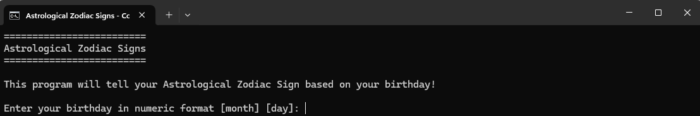
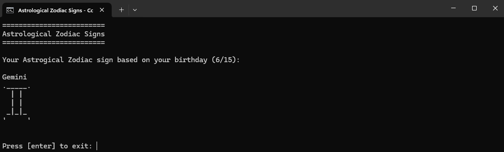
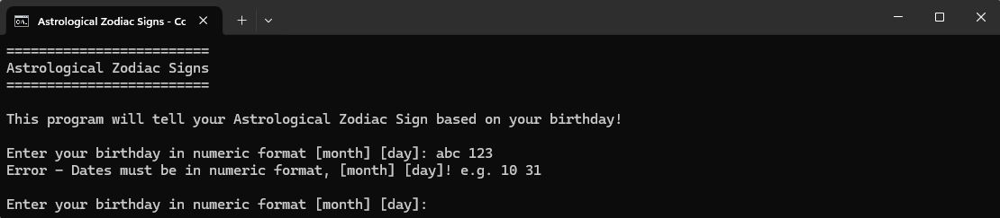

# Assignment 1 - AstrologicalZodiacSigns
**Date:** January 28, 2022

The "Astrological Zodiac Signs" application is a program designed to determine a user's zodiac sign based on their birth date. By integrating fundamental programming principles with a terminal-based interface, this app provides a personalized astrological reading. Users are prompted to enter their birth date in a numeric format, and the application calculates which of the twelve zodiac signs corresponds to their date of birth. This project showcases the application of basic Java syntax, control structures, conditional statements, class implementation, and user input validation.
# Features
* **User Input for Birth Date:** Accepts the user's birth date through a simple text-based interface, requiring inputs for the month and day.

* **Zodiac Sign Determination:** Utilizes conditional logic to accurately match the user's birth date to the corresponding zodiac sign.

* **ASCII Art for Zodiac Signs:** Displays a unique piece of ASCII art representing the zodiac sign determined by the user's birth date.

* **Validation and Error Handling:** Implements error handling to ensure that users enter their birth date in the correct numeric format and within valid ranges.
# Example Images

