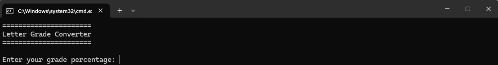
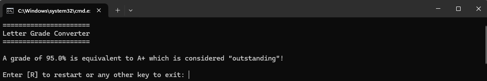
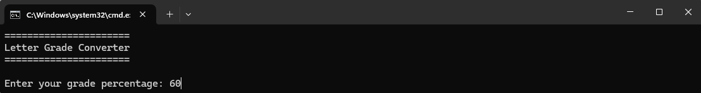
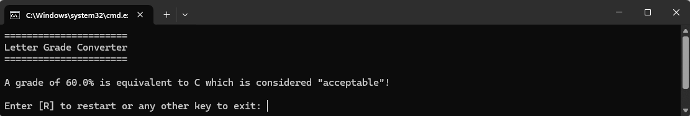
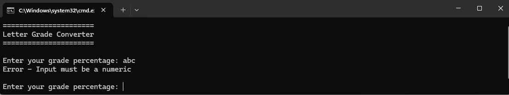

# Assignment 2 - LetterGradeConverter
**Date:** February 18, 2023

The "Letter Grade Converter" is an application designed to translate numerical grades into their corresponding letter grades, offering users insight into their academic performance in a standardized format. This app accepts a percentage grade from the user and provides qualitative feedback on their grade. The integration of the 'Grade' class into this application illustrates the utilization of Java classes and object-oriented programming principles, showcasing the separation of concerns and modular design.
# Features
* **User Input for Grade Percentage:** Users input their grade percentage, which the application accepts through a terminal-based interface.

* **Conversion to Letter Grade:** The application uses the 'Grade' class to convert the numerical grade to a standardized letter grade.

* **Feedback Based on Letter Grade:** Users receive qualitative feedback on their academic performance based on the letter grade.

* **Validation and Error Handling:** Implements validation to ensure numeric input within a valid range.

* **Restart Functionality:** The application offers users the option to restart the grade conversion process.
# Example Images

