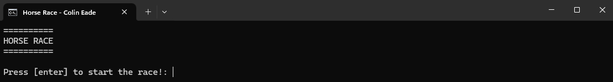
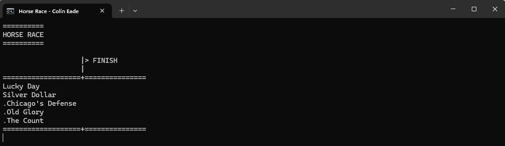
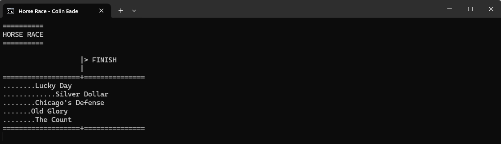
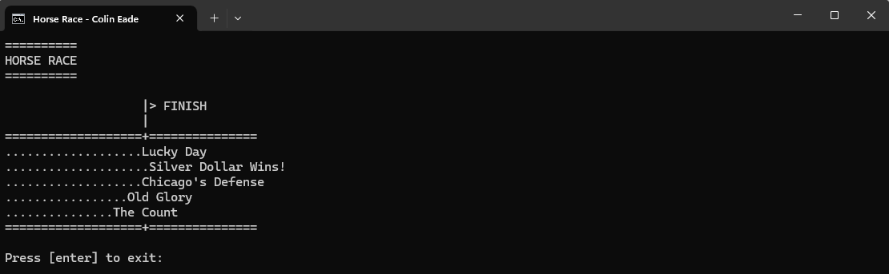

# Assignment 3 - HorseRace
**Date:** March 13, 2023

The "Horse Race" application models a dynamic horse race through a terminal interface, showcasing the practical application of object-oriented programming (OOP) concepts. By employing the 'Horse' class to represent each competitor, the program emphasizes the use of classes and object instances to encapsulate horse properties and behaviors. This approach demonstrates key OOP principles such as encapsulation and class abstraction. Users experience the race in real-time through the terminal interface.
# Features
* **Dynamic Simulation:** The race unfolds in real-time within the terminal, with horses advancing randomly towards the finish line, creating a unique outcome for each race.

* **Object-Oriented Design:** The application showcases object-oriented principles through the use of the Horse class.

* **Interactive User Experience:** Users initiate the race and observe as the horses progress, with a clear declaration of the winner at the end.

* **Terminal-Based Visualization:** The race is visualized through text in the terminal, offering a simple representation of the event.
# Example Images

