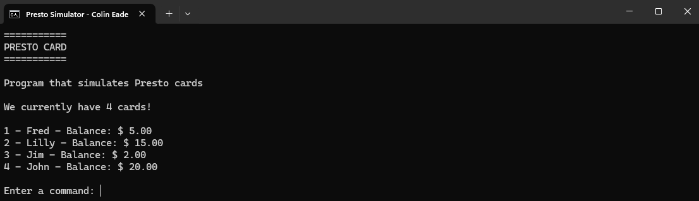
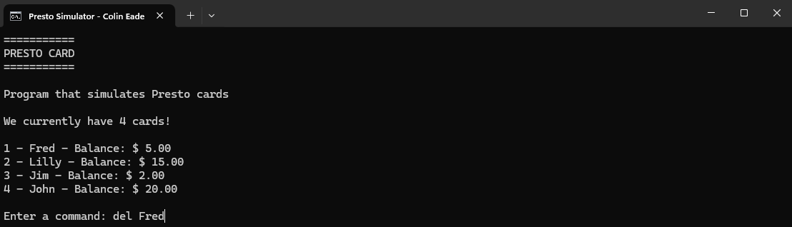
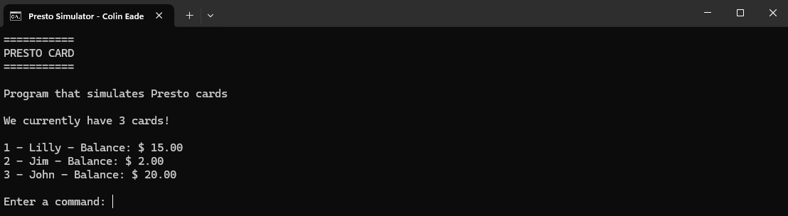
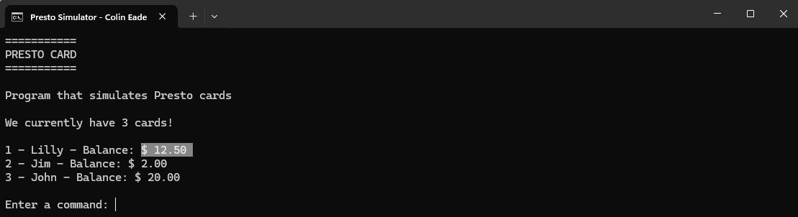
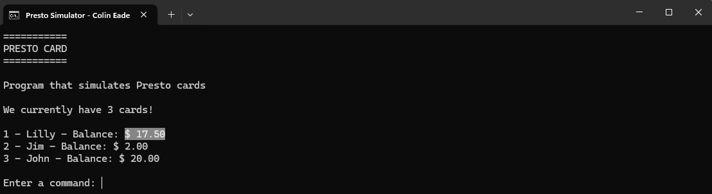
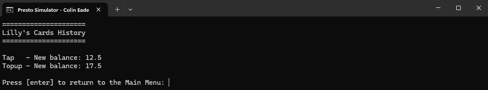
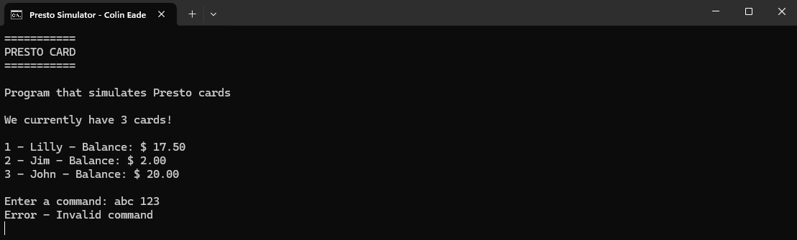

# Assignment 4 - PrestoSimulator
**Date:** March 25, 2023

The "Presto Simulator" application emulates the functionality of a Presto card system, providing a simulation of managing transit payment cards. This project uses the 'PrestoCard' class to encapsulate each card's attributes and operations such as balance checking, topping up, and paying fares. Users can interact with a simulated Presto system through a command-line interface to performing actions like adding new cards, topping up balances, tapping for fares, and viewing transaction histories. This simulation demonstrates the use of ArrayLists to manage multiple objects, offering a practical example of data management and object interaction within a Java application.
# Features
* **Dynamic Card Management:** Enables adding and deleting PrestoCard objects within a dynamic collection.

* **Interactive User Interface:** Command-line interaction for executing card operations like balance checking and topping up.

* **Balance Management:** Functionality to top up card balances and deduct fares upon tapping.

* **Transaction History:** Each card tracks its own history of transactions, which can be reviewed by the user.

* **Error Handling:** Incorporates error checking and validation for user inputs.
# Example Images

