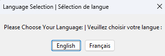
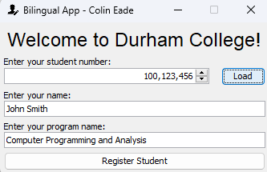
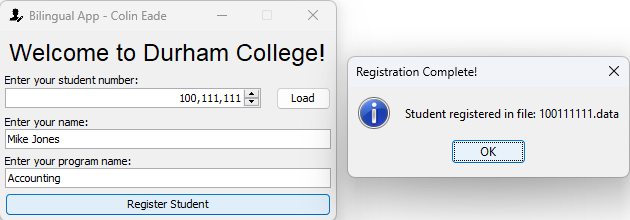
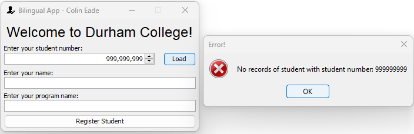
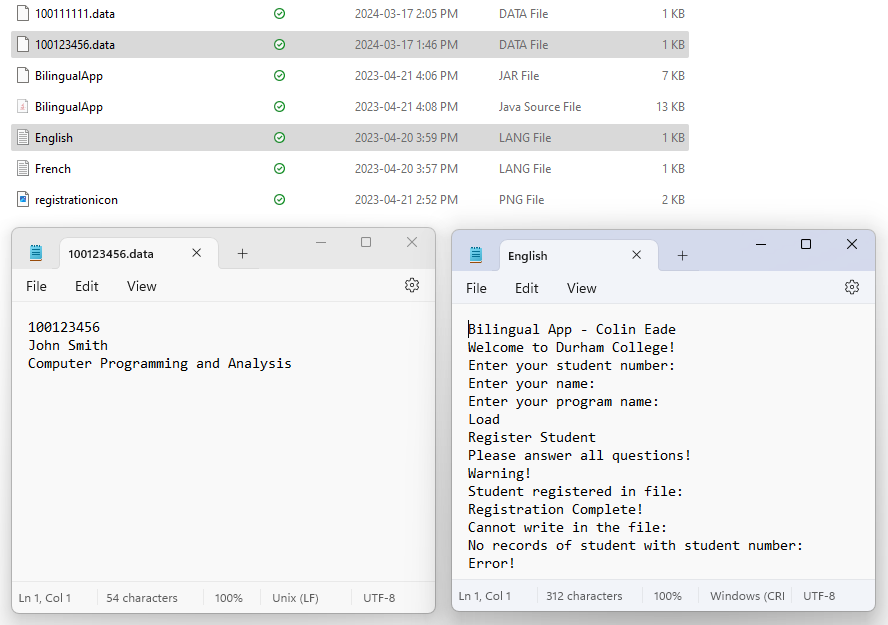

# Assignment 5 - BilingualApp
**Date:** April 18, 2023

The "Bilingual App" is an example of object-oriented programming (OOP) combined with file handling techniques, offering a bilingual interface for educational program registration. It encapsulates core functionalities such as language selection, user interface management, and persistent data storage into distinct files. This implementation underlines the significance of integrating OOP principles with file I/O operations to develop software solutions capable of supporting data persistence.
# Features
* **Language Selection:** Users choose between English and French langauges of the GUI, loaded from the '.lang' files.

* **Entering Registration Details:** Users input their student number, name, and program into designated fields.

* **Saving Registration:** Clicking the 'Register' button saves the input data to a file, with the filename structured as <studentNumber>.data.

* **Loading Registration Data:** Users can retrieve their information by entering their student number and clicking the 'Load' button, demonstrating the app's data persistence and retrieval capabilities.

* **Error Handling:** The app includes error handling to manage invalid inputs and file access issues.
# Example Images

